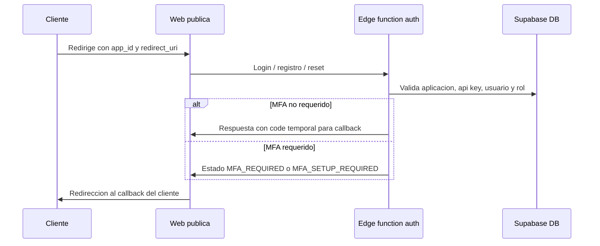
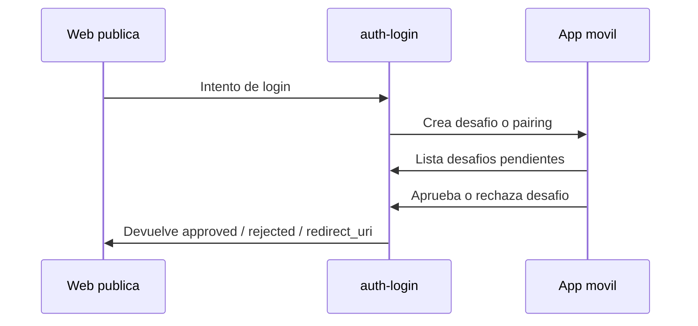
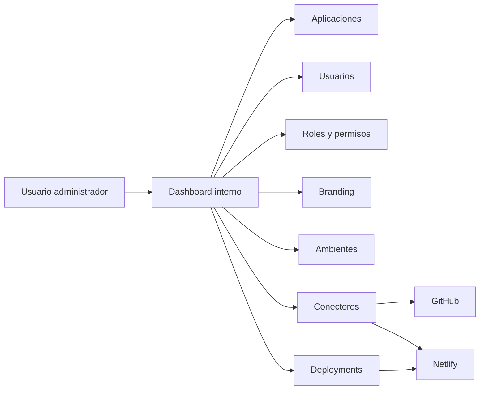

# Arquitectura y negocio de Autenticador

Este documento resume que hace la plataforma, como se conecta por dentro y que ajustes conviene priorizar para que el proyecto quede mas claro, mas seguro y mas facil de mantener.

## 1. Resumen ejecutivo

Autenticador es una plataforma centralizada de identidad para varias aplicaciones.

Su valor principal es este:

- Unifica el acceso de usuarios para distintas apps.
- Permite definir roles y permisos por aplicacion.
- Aplica autenticacion publica con login, registro, recuperacion de contraseña y verificacion de email.
- Suma MFA desde una app movil tipo Authenticator.
- Da a administradores una consola para gestionar usuarios, aplicaciones, branding, ambientes, conectores y despliegues.
- Registra actividad para auditoria y soporte.

En palabras simples: el producto reemplaza la logica de autenticacion y administracion de permisos que normalmente cada aplicacion tendria que construir por su cuenta.

## 2. Arquitectura general

```mermaid
flowchart TB
  subgraph Clientes["Aplicaciones cliente"]
    AppWeb["Web, mobile o backend de terceros"]
  end

  subgraph WebAuth["Capa de autenticacion publica"]
    PublicForms["Login / register / reset / verify"]
    PublicRouter["Router por application_id"]
  end

  subgraph Admin["Panel interno"]
    Dashboard["Dashboard / apps / users / roles / settings"]
    Deployments["Environments / connectors / deployments"]
  end

  subgraph Mobile["App movil Authenticator"]
    ChallengeApp["Aprobacion MFA"]
    Pairing["Pairing de dispositivos"]
  end

  subgraph Runtime["Backend y datos"]
    Supabase[(Supabase DB + Edge Functions)]
    Netlify["Netlify functions / hosting"]
    Express["Express local dev API"]
  end

  subgraph Integrations["Integraciones externas"]
    GitHub["GitHub"]
    NetlifySites["Sitios y deploys Netlify"]
    Email["Email / SMTP"]
    DLocal["DLocal / billing"]
  end

  AppWeb -->|redirect_uri (callback_url alias) o API Key| PublicRouter
  PublicRouter --> PublicForms
  Dashboard --> Supabase
  Deployments --> Supabase
  PublicForms --> Supabase
  ChallengeApp --> Supabase
  Pairing --> Supabase
  Express --> Supabase
  Netlify --> Supabase
  Supabase --> GitHub
  Supabase --> NetlifySites
  Supabase --> Email
  Supabase --> DLocal
```

## 3. Flujos principales

### 3.1 Login y registro



### 3.2 MFA con la app movil



### 3.3 Administracion y despliegues



## 4. Modulos del sistema

### 4.1 Panel web interno

Es la consola para operar el sistema. Desde ahi se administran:

- Aplicaciones registradas.
- Usuarios por aplicacion.
- Roles, menus y permisos.
- Configuracion de autenticacion.
- Branding y textos publicos.
- Ambientes y despliegues.
- Conectores con GitHub y Netlify.
- API keys y logs.

### 4.2 Portal publico de autenticacion

Es la cara visible para el usuario final. Resuelve:

- Login.
- Registro.
- Recuperacion de contraseña.
- Verificacion de email.
- Alta de tenant.
- Redireccion final a la app cliente.

La logica publica usa `application_id`, `redirect_uri` y branding por aplicacion. `callback_url` queda como alias compatible para integraciones antiguas.
Cuando el flujo pasa por redireccion, el callback devuelve un `code` temporal que luego se intercambia por tokens.

### 4.3 App movil Authenticator

La app movil no es solo un visor de codigos. Tambien actua como segunda capa de seguridad:

- Recibe desafios MFA.
- Permite aprobar o rechazar accesos.
- Puede vincular dispositivos.
- Usa biometria para confirmar aprobaciones.
- Puede trabajar con notificaciones push.

### 4.4 Supabase

Supabase es el centro de datos y logica.

Ahí viven:

- Las tablas de aplicaciones, usuarios, roles, permisos, logs, tenants y MFA.
- Las edge functions de auth, MFA, invitaciones, verificacion de email, tenants y despliegue.
- Los estados que el dashboard y el portal publico consultan.

La aplicacion se inicializa leyendo variables de entorno desde `/functions/v1/get-env`. Si ese endpoint no responde, el frontend puede usar variables `VITE_*` del build como respaldo para no bloquear el arranque en desarrollo.
Las edge functions también dependen de variables como `EMAIL_API_URL`, `EMAIL_API_KEY`, `VALIDATION_API_URL` y `SUBSCRIPTION_SYNC_API_URL` para no dejar URLs o secretos fijos en el código.

### 4.5 Netlify, Express y conectores

- Netlify sirve como hosting y proxy de funciones.
- Express se usa para desarrollo local y pruebas de API.
- GitHub y Netlify conectan repositorios, sitios y despliegues.
- Email se usa para verificacion, reset y notificaciones.
- DLocal participa en suscripciones y planes.

## 5. Resumen ejecutivo para alguien no tecnico

Si se lo quieres explicar a alguien de negocio, el mensaje corto es este:

Autenticador es una plataforma que centraliza la identidad digital de varias aplicaciones. En lugar de que cada sistema tenga su propio login, sus propios roles y su propia logica de seguridad, todo eso se administra desde un unico lugar.

Eso trae estas ventajas:

- Menos desarrollo repetido.
- Menos riesgo de seguridad.
- Control central de usuarios y permisos.
- Experiencia de acceso mas consistente.
- Posibilidad de agregar MFA desde celular.
- Mejor trazabilidad para auditoria y soporte.

Para negocio, esto significa que el sistema funciona como un producto de identidad que puede venderse o operarse como servicio para varias aplicaciones o tenants.

## 6. Ajustes que merecen prioridad

### Prioridad alta

- Definir cual es el flujo canonico: redireccion con callback o API directa por ambiente. Hoy conviven ambos.
- Unificar nombres de retorno: `redirect_uri` queda como canonico y `callback_url` como alias retrocompatible.
- Eliminar configuraciones hardcodeadas de Supabase y llaves publicas del frontend y de la app movil.
- Documentar el ciclo completo de MFA: pairing, challenge, aprobacion, rechazo, expiracion y polling.
- Aclarar la fuente de verdad de roles, permisos y menus.

### Prioridad media

- Documentar el modelo de aplicaciones, tenants, usuarios y ambientes.
- Explicar como funcionan branding, textos y favicon por aplicacion.
- Separar mejor lo que es produccion, lo que es proxy local y lo que es simulacion o placeholder.
- Describir integraciones con GitHub, Netlify, Email y DLocal en un lenguaje de producto.

### Prioridad baja

- Mejorar el diagrama visual con iconografia o version grafica aparte si luego se necesita una presentacion comercial.
- Agregar ejemplos por rol de usuario final, admin y soporte.
- Crear una version resumida de una pagina para ventas o stakeholders.

## 7. Plan de trabajo para ajustar los diagramas

### Fase 1. Congelar el flujo canonico

Objetivo: decidir y escribir cual es el camino principal del producto.

- Elegir si el cliente entra por redireccion o por API directa como flujo principal.
- Definir el contrato de respuesta: tokens, code, callback y errores.
- Listar estados oficiales: success, MFA_REQUIRED, MFA_SETUP_REQUIRED, verify_email, reset_password.

### Fase 2. Alinear diagrama con el codigo real

Objetivo: que el dibujo refleje la implementacion actual.

- Revisar `src/App.tsx` para rutas publicas e internas.
- Revisar `supabase/functions/auth-login/index.ts` y funciones relacionadas con MFA.
- Revisar `mobile-authenticator/App.tsx` para los pasos reales del challenge.
- Revisar `src/server/index.js` y `netlify/functions/api.js` para entender que es local y que es proxy.

### Fase 3. Ordenar la documentacion

Objetivo: que cualquier persona encuentre rapido el mapa del sistema.

- Dejar este documento como vista general.
- Mantener `FLUJO_AUTENTICACION_CLIENTE.md` como documento del flujo de integracion.
- Mantener `docs/client-integration-guide.md` como guia de implementacion para terceros.
- Crear enlaces cruzados entre los documentos.

### Fase 4. Corregir deuda tecnica que afecta la documentacion

Objetivo: que la documentacion no describa cosas que no estan realmente listas.

- Reemplazar llaves y URLs hardcodeadas por variables de entorno.
- Marcar claramente servicios que hoy son simulados o parciales.
- Separar ejemplos de produccion de ejemplos de desarrollo local.

### Fase 5. Convertirlo en material de presentacion

Objetivo: usar el mismo contenido para equipo tecnico y no tecnico.

- Hacer una version ejecutiva corta.
- Hacer una version tecnica completa.
- Agregar un diagrama de arquitectura y otro de flujo de usuario.

## 8. Documentos relacionados

- [README principal](../README.md)
- [Flujo de autenticacion del cliente](../FLUJO_AUTENTICACION_CLIENTE.md)
- [Guia de integracion](./client-integration-guide.md)
- [README de la app movil](../mobile-authenticator/README.md)
